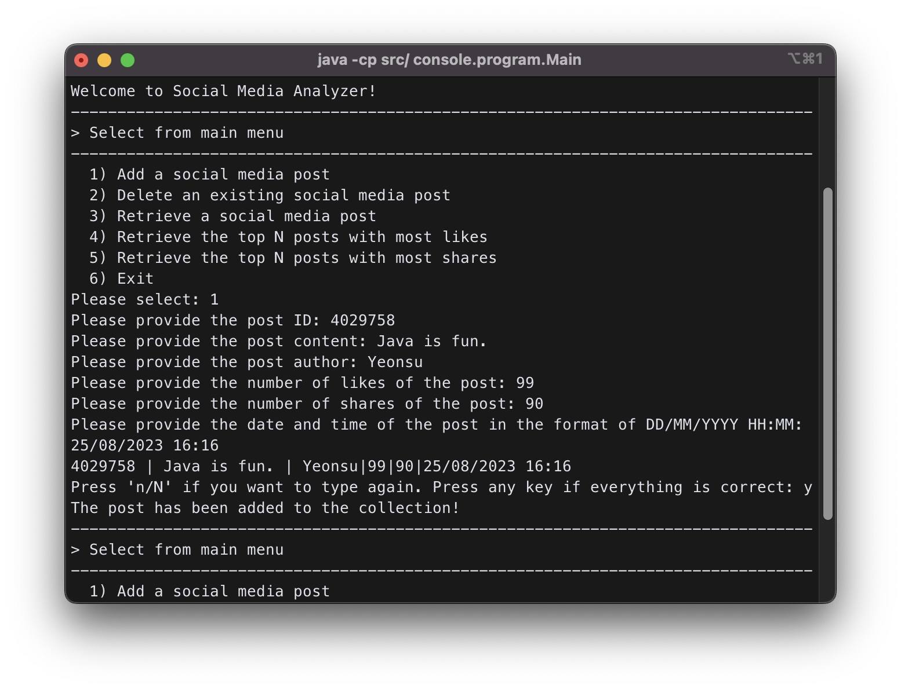
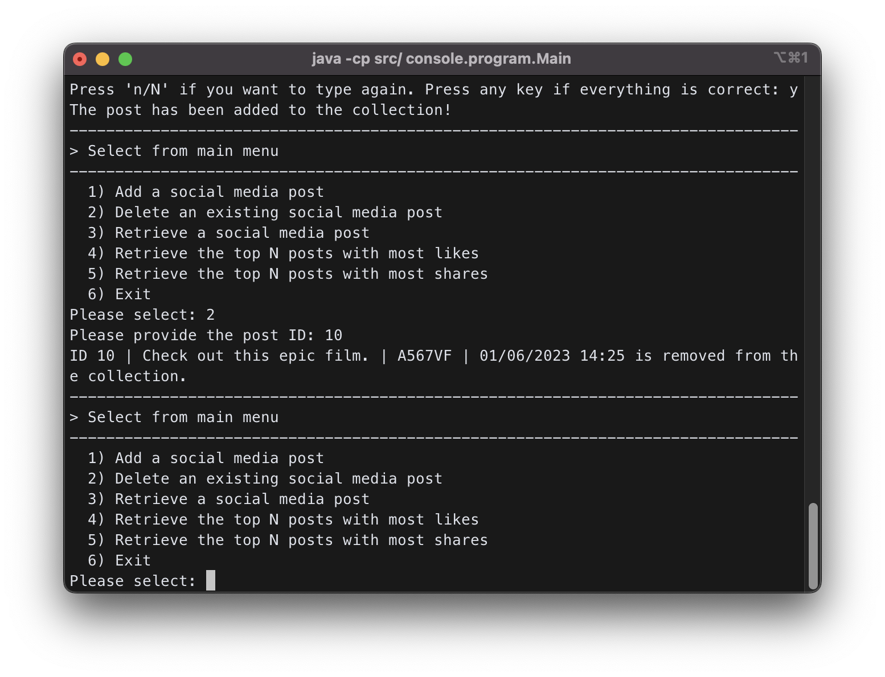
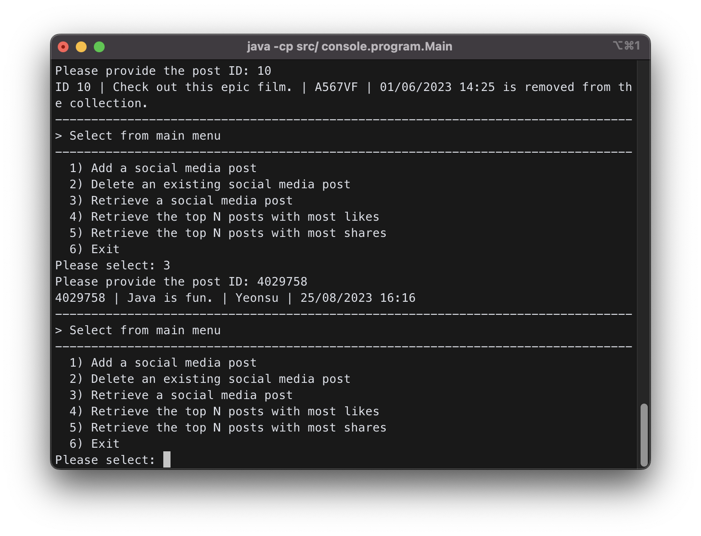
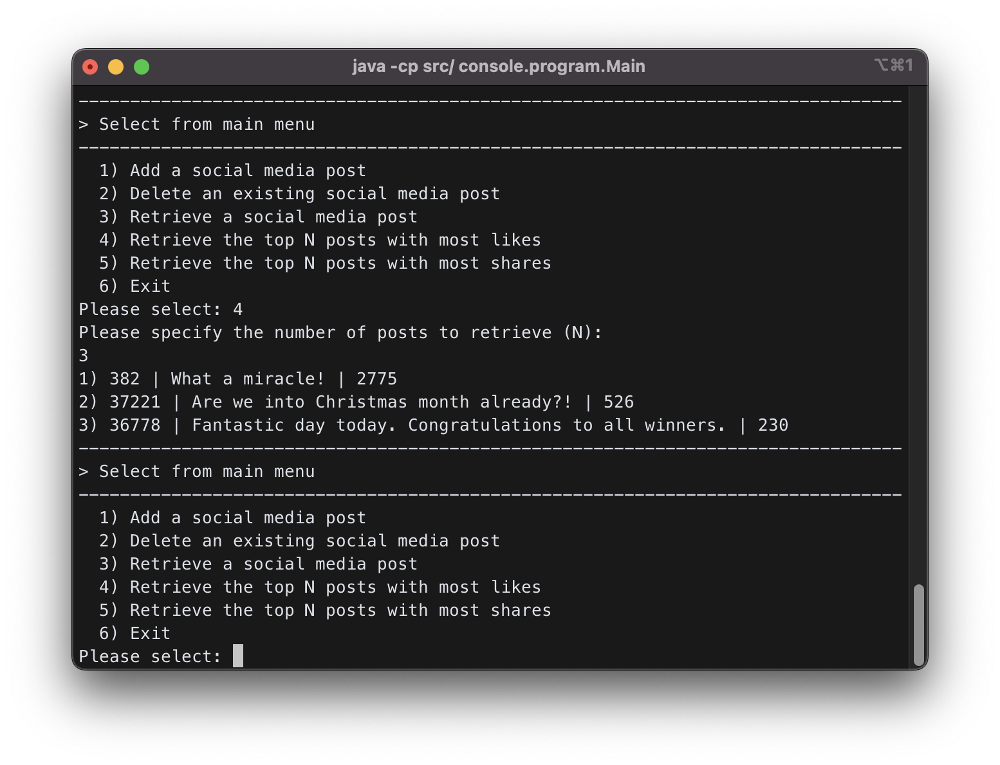
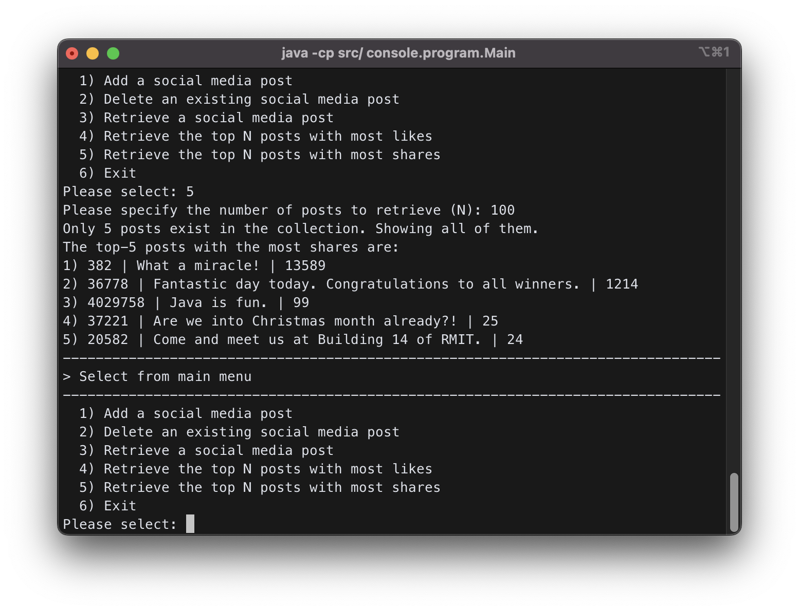

# Further-Programming
## Assignment 1: Social Media Analyzer
### by Yeonsu Sim (s4029758)


#### 📍 How to compile and run your program from the command line.
- move to root or project directory(`/SocialMediaAnalyzer`)
- compile
    ```
        javac src/console/program/*.java
    ```
- run
    ```
        java -cp src/ console.program.Main
    ```

    <p style="text-align:center; margin-top: 4em; margin-bottom:0em;"> Here's a picture of program working on terminal.</p>

    

#### 📍 Instructions as shown in step 2 in the given document.
- Add a post to the collection.


- Remove a post from the collection based on the post ID.


- Retrieve a post from the collection based on the post ID.


- Retrieve the top N posts with the most likes, and show retrieved posts in descending order of #likes.


- Retrieve the top N posts with the most shares, and show retrieved posts in descending order of #shares.
